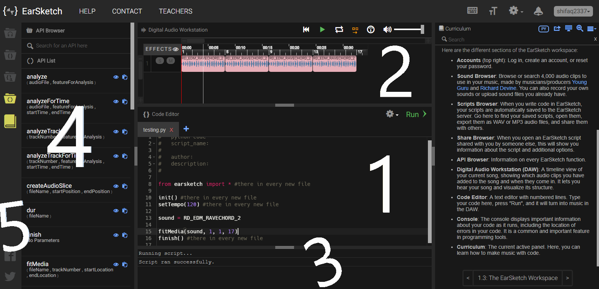

## Week One: _Picking a topic for Independent Study_   

  
---

### Decision 
Since I am an indecisive person, I usually have a hard time picking something to work with. There was a whole list of topics as options to choose for independent study. I was mostly intrigued by the following topics: [**Aframe.io**](https://aframe.io/), [**EarSketch**](https://earsketch.gatech.edu/landing/#/), [**Halite**](https://halite.io/), [**Firebase**](https://firebase.google.com), and **Building your own API**. I contemplated about these potential topics that peaked my interest until I narrowed them down to two topics. **_How?_** **Firebase** was the first option I deleted from my "potential list of topics" list. **_Why?_** I realized I would not know what kind of app to make after learning Firebase and I do not want to make a Firebase tutorial (honestly, that is **_boring and not creative_**). *Firebase, you are fired by me! I'll recruit you again maybe in the future.* *Do you want to know who was fired next?* I will give you a hint: when you try to pronounce it you will say *"Heyyy, light"* or some of you may say *"Huh? light"*. Is the answer Halolight? Nope. It is **Halite**, an open source artificial intelligence programming challenge. Sounds cool, right? However, as someone who is horrible at playing games, does it _really_ make sense for me to try to learn how to create a bot that ultimately has to manage to survive in a game? Nope, I do not have the enthusiasm and mindset to figure out how to last through a game, so I do not want to create a bot that lacks the intelligence to survive through the game. *"Farewell to thee, Halite. Have a nice flight!"*. As someone who had a hard time figuring out how to use an API for my last project, I quickly dismissed the idea of me possibly **building my own API**. Even if I did pick this topic *hypothetically*, it is not like I would know what kind of API to create. That left me to two options from my "possible topics" list. **Aframe.io** is a virtual reality engine/web framework for building virtual reality experiences. Sounds interesting, but when I looked through examples I immediately realized that I would not be able to create an accurate virtual reality experience. I completely did not cross off Aframe.io off of my list. I chose **EarSketch** is a program where you can make music using Python or JavaScript. I like music, I just never knew we could make music using code! With EarSketch, I am a bit worried that just using EarSketch for my project would not be creative. Therefore, if I am done learning EarSketch early, I want to try to to learn another topic. 

### First Impression of EarSketch
As I mentioned in the previous section, I do not consider using only EarSketch and creating music on its own as a creative idea for a project. I believe I can finish learning how to use EarSketch early. If I accomplish learning how to use EarSketch, I will attempt to learn another topic. My goal is to then incorporate the music I produced on EarSketch into what I will create with the other topic.

### Exploring on EarSketch 
When I first went to the [EarSketch](https://earsketch.gatech.edu/landing/#/) website, I watched the video they have on their landing page. Then, I clicked on the green "Get Started" button on the upper-right hand corner of the navigation bar. This action opened a new tab and I was greeted by a coding platform that looked similar to cloud9. 

#### The View:

 1. The part labeled '**1**' is where the whole curriculum is. Lessons and example videos on how to use EarSketch are there. I looked through "Unit 1: Fundamentals" briefly. There was a spiel about why someone should consider learning programming for music in the beginning of Unit 1. Also, I was introduced to unfamiliar terms. For example, I learned that **DAW** stands for **Digital Audio Workstation**. **DAW** is the main tool for producing music and is a software for recording, editing, and playing digital audio files. The neat thing is that you can change and choose the language you want to learn how to make music in. In the screenshot, you can see on the same line as 'Curriculum' an icon that is square-shaped with 'PY' inside, you can click on that icon to change the coding language you want to learn in. You can pick JavaScript or Python to learn how to code in EarSketch to create music. 
 2. **Label '2'** is the **Code Editor** and you can click on the 'Click here to create a new script!' to create a new script and code music! Like how we create an app-sandbox to test out some code. That is how we also create a file. 
 3. **Label '3'** is where the sound collections are located. You can search for a sound or add your own sound. Also, there are filters you can use to search for a specific genre of sound collections. For example, when I click on the green 'Genres' tab and select 'DUBSTEP', I will receive a sound collection of sound constants labeled with 'DUBSTEP'. I can click on the green play button to hear one of the sound constants from the lists. You cannot see in the screenshot, but there are to other icons next to the play icon/button. There is a star icon to add a sound constant to Favorites and there is a clipboard icon that allows you to paste a sound constant into the code editor without you having to copy and paste it yourself manually. 

#### Example: 

1. In this screenshot, the part labeled '**1**' is the **Code Editor** I mentioned briefly while referring to the first screenshot. The coding language shown in this screenshot is Python. You can also choose to make a JavaScript file/script. I just happened to choose Python. Everytime you create a new script it will always automatically include `lines 1-8, line 10, line 11, and line 16`. That is the template. In the screenshot, I commented that these particular lines are present in every new file. `sound` is just a variable that contains a sound constant as its value. `fitMedia` is a method  used to add an audio file to a specified track at specified start and end times. For example, `fitMedia(sound, 1, 1, 17)`. `sound` is the sound constant you want to use. `1` is the specified track number. The second `1` is the specified start time and `17` is the specified end time. 
2. **Label '2'**: is the **DAW**. The DAW in this screenshot is showing the track visually. The available functions under "Effects" for a track is 'S' or 'M'. 'M' is there if you want to mute the track. 'S' is there if you want to hear only one track by muting the other tracks. The ruler looking thing is a measurement, the measurements are referred to for determining start time and end time. On top of those measurements is the actual time that we are used to in seconds. 
3. **Label '3'** = the **Console**. The Console is similar to the JavaScript Console and Python Console we are used to seeing. The Console displays important information about your code when you run the code, like the location of errors in your code. If your code does not have any errors what you see on the screenshot will appear. 
4. **Label '4'** = is an API(Application Programming Interface) Browser. _No surprise there! Afterall, EarSketch is a web app!_ The **API Browser** contains methods that you can use to make music, control sound constants, and edit music. As you can see, each method contains specific parameters. When you use a method in the code editor, what you replace these parameters with become arguments. _This sounds very familiar, right?_ The functionality of methods in EarSketch is **_very_** similar to the the functionality of methods in Ruby. Near each method there are two icons: the eye icon and the clipboard icon. When you click on the eye icon it expands the hidden information about a method. It gives a brief description of each parameter of that method and about its function, so you know what type of information you will need to replace each parameter-name with when using a specific method in the code editor. You can re-click on the eye icon to close the long description. The clipboard icon's function is to paste the method into the code editor.    
5. **Label '5'**: a left-side icon-bar. The icon-bar has five crucial file-shaped icons. The first icon on the top is the 'Sounds' icon which contains the 'Sound Browser' and 'Sound Collections' that can be accessed with one-click on the 'Sounds' icon. The second icon is the 'Scripts' icon, it contains the all your scripts(files) and you can create a new script there. The third icon is the 'Share' icon which is for accessing scripts that other people shared with you. The fourth icon is the 'API' icon which contains the 'API Browser' and 'API List'. The fifth icon 'Curriculum' icon, this simply makes the curriculum appear on the right side of the browser. The top four icons need to be pressed once when you want to access information from a specific icon. The information will show up in **Label '4's'** location. If you double-click any of the top four icons, it will make the information in **Label '4'** recede from view. However, if you want to make the curriculum recede from the view you only need to click on the 'Curriculum' icon once. 

### Takeaways 
- **Look for Similarities**: When we start our journey to learn something new we are afraid of the novel discoveries we will make. What we forget about is that **No matter what new topic/idea/lesson we learn about there will *always* be something that we are familiar with**. I thought that learning how to code in EarSketch is something completely new. However, when I was exploring and looking through EarSketch, I saw that I could use Python or JavaScript to code in EarSketch. I learned how to code in Python before and a little bit of JavaScript too. Also, when I saw the 'API Browser', I looked at the method and instantly realized _'Hey, these methods look very familiar! They look like the methods we learned about recently while we were learning about Ruby!'_. Some of my worries and fears about EarSketch vanished when I found these similarities. We can always look for similarities, I always look for similarities, it is an innate behavior.  
--- 

[**Next**](wk-2.md) 

[**Back to the Homepage**](../README.md)