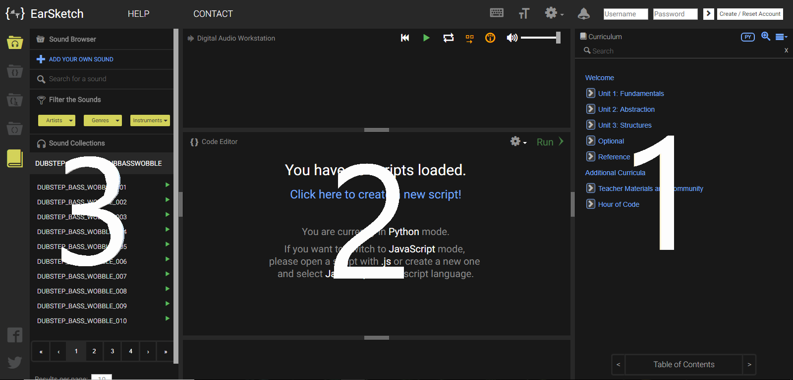

## Week One: _Picking a topic for Independent Study_
---

#### Decision 
Since I am an indecisive person, I usually have a hard time picking something to work with. There was a whole list of options of topics to choose from. I was mostly intrigued by the following topics: [Aframe.io](https://aframe.io/), [EarSketch](https://earsketch.gatech.edu/landing/#/), [Halite](https://halite.io/), [Firebase](https://firebase.google.com), and Building your own API. I contemplated about these potential topics that peaked my interest until I narrowed it down to two topics. *How?* 
**Firebase** was the first option I deleted from my "potential topics" list. *Why?* I realized I would not know what kind of app to make after learning Firebase and I do not want to make a Firebase tutorial (honestly, that is **_boring and not creative_**). *Firebase, you are fired by me! I'll recruit you again maybe in the future.* *Do you want to know who was fired next?* I will give you a hint: when you try to pronounce it you will say *"Heyyy, light"* or some of you may say *"Huh? light"*. Halolight? Nope. It is **Halite**, an open source artificial intelligence programming challenge. Sounds cool, right? However, as someone who is horrible at playing games, does it really make sense for me to try to learn how to create a bot that ultimately has to manage to survive in a game? Nope, I do not have the enthusiasm and minset to figure out how to last through a game, so I do not want to create a bot that lacks the intelligence to survive through the game. *"Farewell to thee, Halite. Have a nice flight!"*. As someone who had a hard time figuring out how to use an API for my last project, I quickly dismissed the idea of me possibly building my own API. Even if I did pick this topic *hypothetically*, it is not like I would know what kind of API to create. That left me to two options from my "possible topics" list. **Aframe.io** is a virtual reality engine/web framework for building virtual reality experiences. Sounds interesting, but when I looked through examples I immediately realized that I would not be able to create an accurate virtual reality experience. I completely did not cross off Aframe.io off of my list. I chose **EarSketch** is a program where you can make music using Python or JavaScript. I like music, I just never knew we could make music using code! With EarSketch, I am a bit worried that just using EarSketch for my project would not be creative. Therefore, if I am done learning EarSketch early, I want to try to to learn another topic. 

#### First Impression of EarSketch
As I mentioned in the previous section, I do not consider using only EarSketch and creating music on its own as a creative idea for a project. I believe I can finish learning how to use EarSketch early. If I accomplish learning how to use EarSketch, I will attempt to learn anohter topic. My goal is to then incorporate the music I produced on EarSketch into what I will create with the other topic.

#### Exploring on EarSketch 
When I first went to the [EarSketch](https://earsketch.gatech.edu/landing/#/) website, I watched the video they have on their landing page. Then, I clicked on the green "Get Started" button on the upper-right hand corner of the navigation bar. This action opened a new tab and I was greeted by a coding platform that looked similar to cloud9. 

The View:

