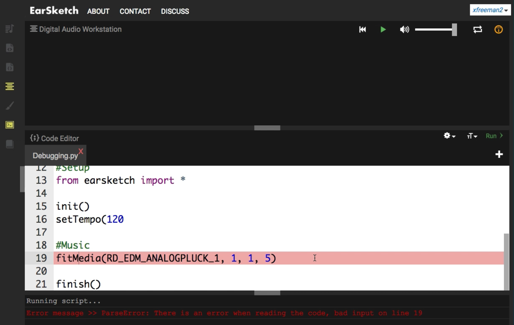
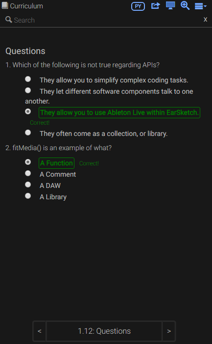
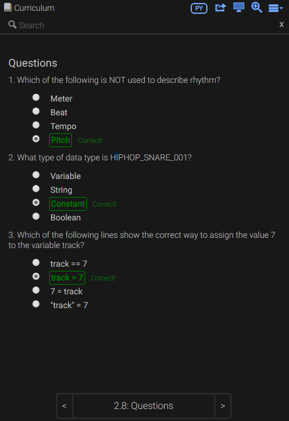
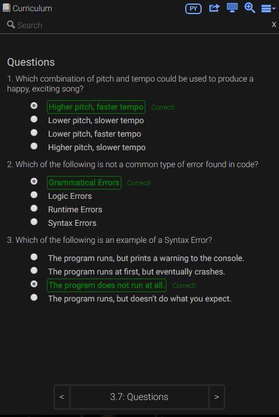
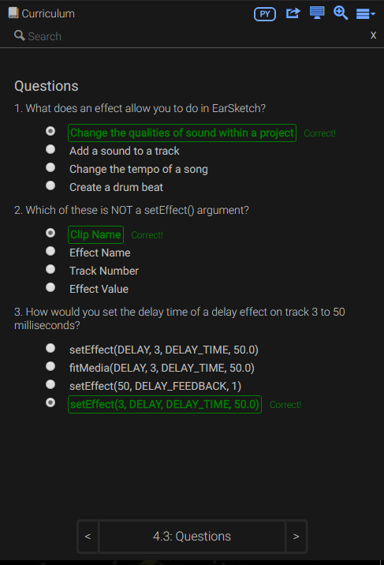

## Week Two: _Learning Time!_

### Choosing the Language
I chose to learn how to code on EarSketch in Python rather than JavaScript because JavaScript is a bit more tedious in that you always need `;` at the end of each line of code. **I prefer Python because I do not have to worry about ending each line of code with a `;`; however, I do need this line `from earsketch import *` before I start to code using the functions in EarSketch.** _I do not have to worry about that though because every time I create a new script this line is already present since it is a part of the setup code. **Thank you EarSketch for having this setup template!**_ I do not have to create a template like I had to in cloud9 when learning Processing, HTML/CSS, Ruby, and Sinatra. This is kind of similar to the example situation of where we had to choose between ERB (Embedded Ruby), HAML (HTML Abstraction Markup Language), and Slim. Many people chose Slim rather than ERB and HAML because it was easy to follow (human-readable), like pseudocode, and you do not have to worry about opening and closing tags. Of course, whitespace matters in Slim meaning you have to be wary of indentations. In my opinion, that is not a limitation because indenting really helps a person follow code more easily. Therefore, you should understand why I chose Python rather than JavaScript (*well one reason why I chose Python*). **Secondly, it is easier to add comments in Python rather than JavaScript.** In Python, you can add a comment or comment out a line of code using a(n) `#` (octothorpe/pound). In JavaScript, you need to use `//` (two forward-slashes). *Now let us think for a second. Do not admit it if you do not want to, but we are all **LAZY**! Does your finger **REALLY** want to press `/` twice just to make a comment!? Will you really remember to press `/` twice—I'm not saying you cannot—just saying that I want to help my brain by not remembering extra tiny details! If you want to argue with me go ahead, but I am ending this chapter here.* It has been 4 years since I learned Python, so I want to refresh my memory. 

### Vocabulary
**Unit 1, Chapters 2 and 3 of the EarSketch Curriculum**

-- **Rhythm:** how sounds are arranged as music flows through time **_OR_** the arrangement of sounds as music flows through time.

- **Words that are used to describe rhythm:** tempo, meter, measure, beat, and sub-beat.

-- **Beat:** a basic unit of time in music
- **Sub-beats:** divisions of a beat

-- **Tempo:** the overall speed of a song. 

- Tempo affects the length of a beat.
- Tempo is measured in **_beats per minute (bpm)_**.
- I learned that **_Higher tempos mean that the songs are faster and the songs have a shorter beat duration._**

-- **Variables** in EarSketch are no different than variables we learned about in previous coding languages. **In EarSketch, variables are used to both store data and to easily make changes to your script by simply changing what the data the variable is storing.** _This is more efficient than changing a sound constant in every line of code where you want to change a sound constant._

-- **Constant:** store values that never change. In EarSketch, constants are used to refer to sound/audio files that can be used in a script. Like the sound constants from the sound collection. 

-- **The Console** can help in debugging your code by letting you know when your code cannot run properly or when you forget to include something.  
  

-- There are **3 types of Errors**:

- **Syntax errors:** When your code does not follow the syntax rules. 
- **Runtime errors:** When the program starts to run, but stops due to an error. *Example: a Parse Error*
- **Logic errors:** When your program runs, but does not do what you expect it to do. 

**_NOTE: The Console does not tell you that you have a syntax/logic/runtime error, but it implicitly tells you what your error is._** For example, in the example below, you can see that the Console shows that there is a Parse Error on line 19. We can assume that this error is both a syntax error and a runtime error. *I honestly did not know what a Parse Error was, so I searched for a definition of it on Google.*

#### Parse Error Example: 

**Unit 1, Chapters 4 and 5 of the EarSketch Curriculum**

-- **Effects:** change the qualities of a sound to make them more unique

- Effects are implemented in EarSketch with the `setEffect()` function.

-- Syntax of **`setEffect()` to add effect to the whole track**: `setEffect(trackNumber, effectName, effectParameter, effectValue)`

- **`trackNumber`:** The track (number) the effect is added to.
- **`effectName`:** The specific effect being used.
- **`effectParameter`:** The setting used for the effect.
- **`effectValue`:** The value of the parameter(a number in a specific range).

-- **Envelopes:** define how an effect parameter changes over time. 

- Envelopes allow you to add effects to smaller portions of a track and define how an effect’s parameters change over time. 

-- **The 7-parameter `setEffect()` needs to be used to create envelopes**. Syntax of the 7-parameter **`setEffect()`:** `setEffect(track, effectType, effectParameter, effectStartValue, effectStartLocation, effectEndValue, effectEndLocation)`

- **`trackNumber`:** The track (number) the effect is added to.
- **`effectName`:** The specific effect being used.
- **`effectParameter`:** The setting used for the effect.
- **`effectStartValue`:** The starting value of the parameter.
- **`effectStartLocation`:** The measure at which the starting value is set.
- **`effectEndValue`:** The ending value of the parameter.
- **`effectEndLocation`:** The measure at which the ending value is set.

**_NOTE TO SELF: When you want to create envelopes, please remember to use all 7 parameters of `setEffect()`!_**

-- ***Filtering:**— *Question: Is it like filtering inappropriate words from a song? No, that is censoring!*— **is the process of removing certain (frequency) components of a sound.**

-- **Reverb:** an effect in which a sound persists after it is initially played. **_My understanding? It is kind of like echo!? EarSketch's audio examples and video examples helped me make that connection. Otherwise, I would still be wondering what in the world a reverb actually is?_** 

### Impression of the EarSketch Curriculum
The EarSketch Curriculum is very straight-forward. The vocabulary words are all defined by EarSketch within the Curriculum. **_Do you know what that means? I do not even have to open a new tab to search a word I do not know on Google! Plus, it saves me so much time from stressing about words I am not familiar with!_** His/Her Majesty, EarSketch has helpful code-along videos within the EarSketch Curriculum! *That helps me understand the code better.* Of course, when I do not understand a vocabulary word,—*even after reading the definition or explanation of the term*—there are videos with a person explaining the term more specifically and if the term can be audibly demonstrated there are audio file examples that help you audibly understand the term. The EarSketch Curriculum is well organized. There are 3 main units and within these units are chapters. Additional curricula is available with links to an [online textbook](http://earsketch.gatech.edu/itec2120/book.html), a [free Massive Open Online Course (MOOC)](https://www.coursera.org/learn/music-technology/), and an [8-week introduction program to Python MC](https://pythonmc.trinket.io/python-mc-8-week-introduction-to-python#/getting-started-with-python-mc/what-is-python-mc). Once you are done with each chapter in a unit, there is a chapter summary and there is a small quiz for self-checking your understanding of the chapter. 

#### Examples of Chapter Quizzes I took

### Takeaways
- **Consider your options and pick what you believe is fit for you:** I had the choice of picking Python or JavaScript as the language to learn how to code on EarSketch in. I looked at code snippets of both Python and JavaScript, and then looked for differences and similarities. I realized that Python did not require any semi-colons at the end of each line of code like JavaScript did. If I pick JavaScript, I know that I am the type of person who will probably forget to add a semi-colon at the end of each line of code and waste time looking for errors, and then realize that I forgot to add a semi-colon at line x. Also, commenting is easier and efficient (in my opinion) in Python rather than JavaScript since it is the same as commenting in Ruby. Therefore, I considered these factors and chose Python as the coding/scripting language for myself to learn the EarSketch Curriculum in. 
- **Use the resources around you!:** I know my situation is not very relatable in this situation, but I did use the resources around me. For me, the resources are within the EarSketch Curriculum. The code-along videos, audio file examples, the chapter quizzes, and explanation videos are the resources I used to help myself better understand the lessons. 

### Next Steps 
- I did not finish the 1st Unit of the EarSketch Curriculum yet! I have 3 more chapters (about 25%) to complete in order to complete Unit 1. Therefore, during week three, I will be completing Unit1 and then hopefully I will at least complete 50% of Unit 2. 

---

[**Next**](wk-3.md)

[**Back**](wk-1.md)

[**Back to the Homepage**](../README.md)