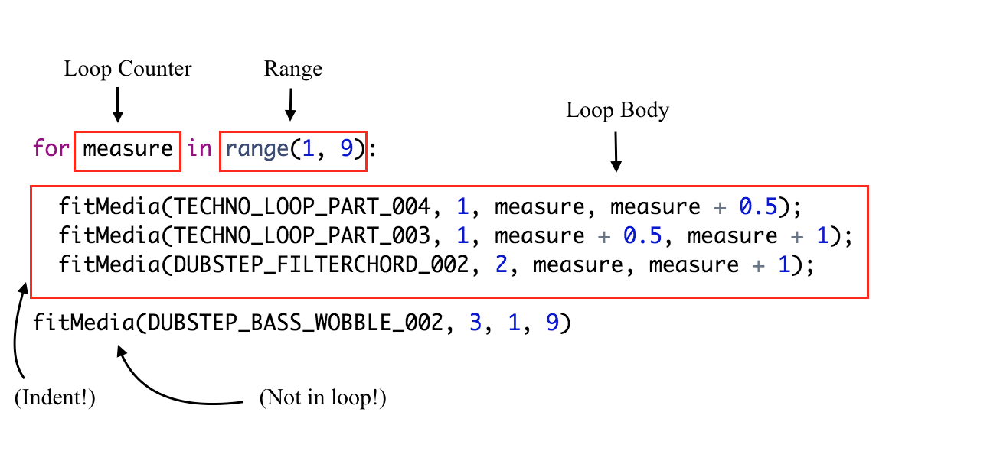

## Week 3: Copyright and Abstraction

### Copyright
I am sure you all have heard of "copyright" somewhere maybe in an article or in a class. *What exactly is copyright and why is it such a big deal?* **Copyright** is the part of the law that covers ownership of creative work. In other words, copyright is a license that says this specific person/company owns a specific piece of creative work. In the United States, having a copyright gives you six exclusive rights over what you create: to make copies, to make derivative works (making a new work based on the original), to distribute copies (give them to your friends or sell them (if it is not under a label)), to perform publicly, to display publicly (mostly for visual works), and to digitally transmit (the rights to stream a song or movie). This hopes to prevent someone from plagiarizing your work. _Does that really prevent someone from using your work without your permission? No! So what is it called when someone uses your work without your permission even though you have a copyright?_ **Copyright infringement!** That is when the **rights over _your_ work** are **violated** by someone else. *Remember using the Creative Commons website to search photos and other creative work and then putting it on your website? Also, do you remember having to put the source and the username of the person you got the image or creative work from?* You were able to do that only because those particular images and creative works had **Creative Commons licenses**. _What is a Creative Commons license?_ A **Creative Commons license** lets creators specify what rights they keep and what rights they give away regarding their piece of creative work. **Fair use** is the part of copyright law states that brief excerpts of copyright material may, under certain circumstances, be quoted verbatim for purposes such as criticism, news reporting, teaching, and research, without the need for permission from or payment to the copyright holder. Of course, if you use more of someone's work, it is less likely to be fair use. If the original work is published, it is less likely to be fair use. If you using the original work disrupts the sales of the original work, then it is less likely to be fair use. 

### The Idea of Abstraction
Abstraction in software engineering and computer science is a little different than the "abstraction" we learn about in English courses. *The engineer at Stash used abstraction while talking about his code, but he did not explain it.* In software engineering and computer science, **_Abstraction_** is a technique of organizing intricacy of computer systems. **_I know you are probably thinking,"This still does not ring any bells!"_** Well, that is because we never heard the term "abstraction" in SEP class, but indeed we are familiar with the context just not the term. Do you all remember **DRY (Don't Repeat Yourself)**? Well, the "**abstraction principle**" is the generalization of DRY principle. *What!? Is this really true? Yes, even I did not know until I researched about Abstraction.* **_All along we were talking about the abstraction principle whenever we talked about being DRY!_** The **abstraction principle** is a basic dictum that advises programmers to use abstractions whenever possible to avoid duplication (of code). **_You might wonder why I would bother researching about "abstraction" or the "abstraction principle"._** Well, **Unit 2 of EarSketch is called "Abstraction"**, so I was curious what "abstraction" meant in software engineering. I also wanted to understand why EarSketch would name a whole unit as "Abstraction". After researching about abstraction, I realized that the lessons under Unit 2 were truly about "Abstraction" as EarSketch labeled.     

#### Examples of Abstraction
-- **Loop(s):**a programmed sequence of instructions that are repeated until or while a particular condition is satisfied.

**This is an example of a for loop in EarSketch:**

 
###### (source: EarSketch)

- **Loop Body:** contains the statements that will execute repeatedly. Everything inside is indented (using the tab key) directly after the colon `:`. The `:` is like the `do` in Ruby. 

- **Loop Counter:** a variable to be used as a loop counter. You do not need to declare that the variable is equal to some value before saying `for i in range(0, x):`. The variable is created the moment you say `for measure in range(0, 9):`.
- **Range:** a function that makes a list of numbers for the loop counter to count through.

-- **Custom Functions:** allow you to write your own functions and avoid repetitive code. *Reminds me of how I created methods in Ruby and then used those methods inside of other methods!*

### Takeaways
- **Research to find out what you can or cannot do:** In my entry, I talked about legally what you can or cannot do with a work that has a copyright. I had to research about that. I am dealing with music, so my situation will be different. However, sometimes we think that we can do something to produce a certain expected result, but then we realize that maybe we do not know all the information (i.e.coding pieces) to produce our expected result. That is when you need to do research (maybe on the syntax of something, or how to make your code more efficient).  
- **Sometimes understanding and knowing the specific idea before understanding the general idea helps you understand the general idea better:** *I know that sounded very repetitive and probably confusing, but I will try my best to explain what I mean!* The DRY principle is a very specific idea, and it is straight to the point. It is like an acronym. Understanding and knowing what the DRY principle was helped me understand "Abstraction" and the abstraction principle better when I researched about them. If I did not understand the DRY principle or did not know what the DRY principle was it would have been difficult for me to grasp what abstraction and the abstraction principle meant. In other words, using specific knowledge about something you learned about before can help you understand the general idea/big idea of that specific knowledge. 

### Next Steps
- By the end of the fourth week, I hope to finish Unit 3 of the EarSketch curriculum and to start working on a project. 
- I will practice more with creating loops and custom functions while learning the lessons in Unit 3. 
---
[**Next**](wk-4.md)

[**Back**](wk-2.md)

[**Back to the Homepage**](../README.md)