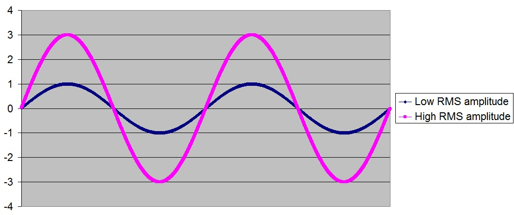

## Week 4: Ways to learn efficiently  

### Checking out other resources
I was thinking of checking out the [**EarSketch Online Textbook**](http://earsketch.gatech.edu/itec2120/book.html) after I finished Unit 3 of the curriculum, but I decided to allow my curiosity to dictate my actions. While I was going through the Unit 3 lesson chapters, I was also going through the textbook. I noticed that the textbook had more examples of entirely Python code snippets. The code snippets were Python Tutor examples where you can press forward and the program will go through each line of code and execute it. It is like breaking done the code yourself, but the program is breaking the code down for you instead. *I usually spend a lot of time on my own trying to break down the code and sometimes I cannot seem to connect the pieces or keep track of my own thoughts! This program is really helpful because it shows you what each line of code does in a straightforward manner.* Essentially, the textbook contains pretty much the same information as the EarSketch curriculum, but there are some concepts that are more specifically explained in the textbook rather than the curriculum. 

#### Explanation of concepts in the EarSketch online textbook that I did not understand in the EarSketch curriculum:
-- Specific sound effects

- **VOLUME**: how loud a track is
- - **GAIN**: The amount to change and specify the volume.
- - Ranges from -60.0 decibels to 12.0 decibels.
- - Original volume is 0.0 decibel.
- **PAN**: best heard with headphones. Example: Sometimes you hear the right side of your headphone is ore louder than the right side. PAN helps to make the music sound good with headphones. 
- - **LEFT_RIGHT**: Adjusts where the sound falls between the left and right stereo speakers or headphones.
- - Ranges from -100.0 (all the way left) to 100.0 (all the way right)
- **DELAY**: adds echos/echoes to the sound
- - **DELAY_TIME**: Adjusts time between echoes in milliseconds (ms).
- - Ranges from 0.0 (no delay) to 4000 (4 second delay).
- - **MIX**: Adjusts the volume of the delayed sound versus the original sound without delay.
- **DISTORTION**: makes a sound lofi(lower) and noisier.
- - **DISTO_GAIN**: The amount of distortion applied to the signal.
- - Ranges from 0.0 (no distortion) to 50.0 (maximum distortion).

-- **Sonification**: a way to use non-speech audio to convey information, or in other words, turning data into sound.

#### Vocabulary from Unit 3
-- **Data Structure:** allows a single entity to hold an entire collection of values. **_NOT AN ARRAY! IT ALLOWS THE EXISTENCE OF A LIST IN EARSKETCH!_**

- **List:** is a collection of values combined into a single entity, an efficient way to store data. **Basically, it is an array or another word for an array!**

- For loops are used to iterate through data structures. We used `.each()` in Ruby to do this. 

-- **makeBeat(fileName, track, measure, string)**

- **fileName:** the sound file
- **track:** track number
- **measure:** the start time
- **string:** the beat you want. Ex: `beatPattern = "0+++++------++++0"`. The string in this case is `"0+++++------++++0"`.  
##### Snippet of code
```python
#Setup
from earsketch import *
from random import *  # need to import the random library to use randint(). 
init()
setTempo(100)

#Music
sampleBank = [YG_TRAP_SYNTH_BELL_1,
			  YG_TRAP_STRINGS_1,
			  YG_TRAP_SHORT_SYNTH_1,
			  YG_TRAP_HIT_1,
			  YG_TRAP_SYNTH_LEAD_6,
			  YG_TRAP_BELLS_1]


for i in range(1, 9):

	index = randint(0, len(sampleBank) - 1) # Generates a random index number between 0 and 5 because the length of sampleBank list is 6 (total number of samples)
	fitMedia(sampleBank[index], 1, i, i+1) # Use the random index to get a list element

fitMedia(YG_TRAP_KICK_4, 2, 1, 9)
fitMedia(YG_TRAP_BASS_1, 3, 1, 9)
fitMedia(YG_TRAP_SNARE_5, 4, 1, 9)

#Finish
finish()
```
- I find it interesting that I need to import the random library to use `randint()` since I did not need to do that back when I learned p5js.
- Indentation is key. I did not need to indent values inside an array when I learned Ruby and other languages. 

-- **readInput()** function is used for console input.

-- **Console Input:** text-based data taken from the keyboard, giving a program access to information from the user. *Similar to the Command Line we use in cloud9. It is more similar to when we learned JavaScript and was able to ask for a user input and then use that user input to make the program do something.*

- In EarSketch, the console input is an interaction between the user and the program. The user input can be taken to produce music. 
- You can do this by (sometimes) converting the user input to a string, integer, or float depending on what you want the user to be able to change.

##### Example
```python
#Setup
from earsketch import *
init()
t = readInput("Set a valid tempo for this song (120 - 160): ") #asks user to set tempo for the song
print "You set a tempo of " + t + "bpm"
tempo = int(t)
setTempo(tempo) #sets temp to be the tempo the user chose

#Music
kick = OS_KICK02
clap = OS_CLAP04
beatString1 = "0+++++--------00"
beatString2 = "0++0++0++++++---"
clipNum = readInput("Select a clip number between 10 and 46: ") #asks user to chose clip number
dubStepClip = "DUBSTEP_BASS_WOBBLE_0"
finalClip = dubStepClip + clipNum #concatenating dubStepClip and user chosen clip number.

# user selected dubstep wobbles
fitMedia(finalClip, 1, 1, 5)
# kick
for measure in range(1, 5, 2):
  makeBeat(kick, 2, measure, (beatString1 + beatString2))
# clap
for measure in range(2, 6):
  fitMedia(clap, 3, measure - 0.5, measure - 0.25)

#Finish
finish()
```
- When I first began using EarSketch, I thought there was no way to take any user inputs. **_I was wrong!_** I did not expect the console in EarSketch to have the ability to take user inputs. This really makes me want to create a script for my final project with user inputs. However, there are some cons such as not knowing how the song would sound if I allowed user inputs to control how the song turns out. I will most likely cross out this idea. 

-- We all know Booleans from previous languages, but **_how are Booleans used in EarSketch?_** That was the question that popped up in my head while I was reading about Booleans in EarSketch. 

- **Booleans** are used in EarSketch to decide when certain music plays at which measure (point). 
- **Boolean Operators** (*Trust me, you all know these too!*) 
- - **and:** only **True** when **_both_** inputs are **True**
- - **or:** **True** when at least **_one_** input is **True**
- - **not:** **returns** the **opposite** boolean value

-- How are **Conditionals** used in EarSketch?

- if, elif, and else statements. *I remember seeing these and using these 4 yrs ago in Python!*
- If the if statement is **false** the elif statement runs and if elif is also **false** else statement runs.

##### Syntax for conditional (if statement)
```python
if (condition):
    statement to execute if condition evaluates to True
```
-- **RMS Amplitude:** is defined as the root mean square (a kind of average) of the amplitude of a sound and is related to the volume of the sound

- A sound with high RMS amplitude will be loud.
- A sound with a low RMS amplitude will be soft.

 
###### (source: EarSketch 22.2)

-- **analyze()** looks at a clip and analyzes it using a method of our choice.

- Syntax: **`analyze(clipToAnalyze, analysisMethod)`**
- Return values: 0 = softest & 1 = loudest

-- **Spectral centroid:** defined as the average frequency of a sound and relates to the “brightness” of the sound.

- High spectral centroid = Brighter (usually, sounds higher in pitch)
- Low spectral centroid = Less bright (usually, sounds lower in pitch)

-- **Spectrograph:** shows the loudness of different frequencies at different times in the song. 

-- **Sonification:** a way to use non-speech audio to convey information, or in other words, turning data into sound. 

- **_I will not reveal anything, but this idea really made me come up up with two ideas for what to create as my final project._** *Whether you are interested or not, I will not reveal to you what these two ideas are! You will just have to wait to see*. 

### Takeaways
- **Using other useful resources to understand something better:** *You probably heard that thousands of times, and are rolling your eyes right now! It does not matter, I will say it again!* I was very absorbed in learning and finishing the EarSketch curriculum that I did not really consider using additional/other resources. I decided to check out the EarSketch online textbook out of curiosity to check if it was different from the EarSketch curriculum. To my surprise, it had some of the same lessons as the EarSketch curriculum, but with more specific explanations and more general examples. 
- **Sometimes understanding the general concept/idea helps you understand the specific idea better:** I know this is the complete opposite of what I said in my previous entry. *You are probably wondering why the sudden 180° turn?* Well, that is because this time I needed to understand the general ideas and concepts to understand how these ideas were applied in EarSketch. Also, I am the type of person who has been taught that (sometimes) memorizing the general ideas is better than trying to remember the specific ideas. *Especially, when you are trying to cram everything you learned for an upcoming exam. Then, the day of the exam comes and you forget half of the specific ideas you tried to memorize due to becoming nervous. I have been through a situation like that before and trust me when I heard this advice from one of my teachers I realized 'what have I been doing all my life!?'. I have been wasting my energy by memorizing all the small details when my brain actually remembers the 'big ideas' better. From now on, I will only try to remember the general ideas (I will memorize specific details only when I need to).*

### Next Steps
- I thought I would be done learning after I finished the Unit 3 curriculum, but I decided that I will continue to check out the "Optional" section and "Hour of Code" section of the EarSketch curriculum next week. 
- I will try to research more about my possible final project ideas to either approve or reject my ideas. I will approve either one of my ideas if there is proof that my idea is realistic and doable. 
- Practice! I will have to practice more by coding more in EarSketch. 

---

[**Next**](wk-5.md)

[**Back**](wk-3.md)

[**Back to the Homepage**](../README.md)